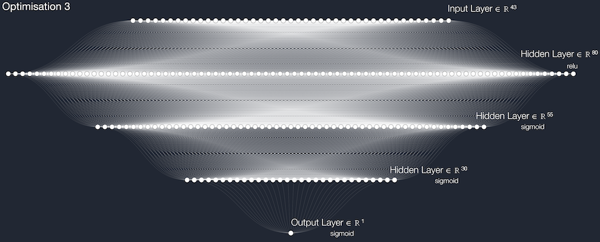
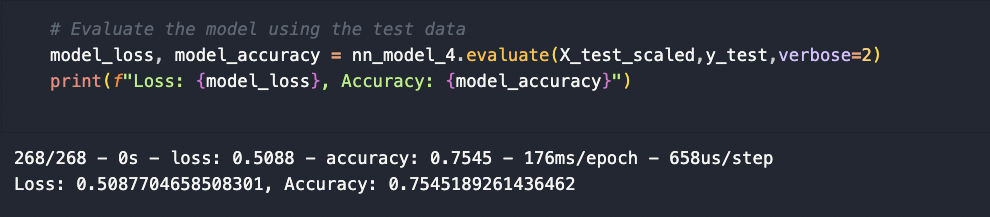
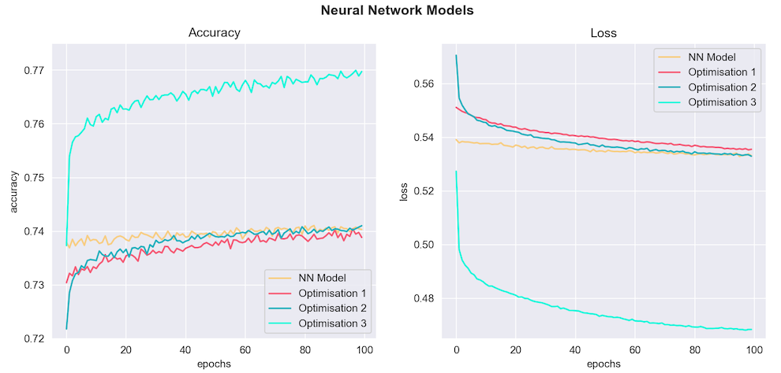

# TensorFlow Deep Neural Network Challenge

A TensorFlow Neural Network Model that predicts grant applications with the best chance of success for the nonprofit foundation, Alphabet Soup.

Created and submitted for an assignment for Monash University Data Analytics Boot Camp (October 2023).


## Table of Contents

- [General info](#general-info)
- [Technologies](#technologies)
- [Screenshots](#screenshots)
- [Code example](#code-example)
- [References](#references)

## General info

### AlphabetSoupCharity.ipynb

- Reads in data as Python Pandas DataFrame from URL.
- Drops `EIN` and `NAME` columns to refine input features for model.
- Bins `APPLICATION_TYPE` and `CLASSIFICATION` columns to reduce number of unique categorical values.
- Creates discrete variables for:
  - Labels (y): the target or predicted variable (`IS_SUCCESSFUL`).
  - Features (X): the variables used to predict y.
- Splits Features (X) and Labels (y) further into Training and Test data using `train_test_split()` module from machine learning library `scikit-learn`:
  - Training data (75 % of the total dataset):
    - `X_train`: Features data used to train the model.
    - `y_train`: Labels data used to train the model.
  - Test Data (25 % of the total dataset):
    - `X_test`: Features data used to test the model.
    - `y_test`: Labels data used to tes the model.
- Defines the TensorFlow `Keras` Sequential model:
  - Forty-three **inputs** containined in `X_train`.
  - Two **hidden layers** containing `80` and `30` neurons assigned to `relu` activation function.
  - One **output layer** with `sigmoid` activation function.

- Compiles, trains and evaluates the model:
  - Accuracy: `72.9 %` / Loss: `55.9 %`

- Plots Model Accuracy and Loss.

### AlphabetSoupCharity_Optimisation_1.ipynb

- Optimises Neural Network model by employing `Keras-Tuner` to auto-optimise model parameters.
- Compiles, trains and evaluates the model:
  - Accuracy: `73 %` / Loss: `55.3 %`

### AlphabetSoupCharity_Optimisation_2.ipynb

- Drops inconsequential `STATUS` column to refine model inputs.
- Adds an extra **hidden layer** containing **55 neurons** and `relu` activation function to better handle the complexity of the model features.
- Compiles, trains and evaluates the model:
  - Accuracy: `72.9 %` / Loss: `56.7 %`

### AlphabetSoupCharity_Optimisation_3.ipynb

- Retains `NAME` column because it appeared to be associated with project sucess. The column was binned to reduce the number of unique categorical values.
- Including `NAME` column increased the number of inputs to `71`.
- The **hidden layers** contained **80**, **55** and **30** **neurons** assigned to `relu`, `sigmoid` and `sigmoid` activation functions, respectively.
- Compiles, trains and evaluates the model:
  - Accuracy: `75.5 %` / Loss: `50.9 %`
- Optimised Fully Connected NN Diagram:



### NN_Charts.ipynb

- Compiles and plots all Accurary and Loss values from the above Neural Network Models.

### nn_model_report.md

- Describes purpose of the model.
- Analyses the results and discusses model optimisations.
- Summarises the analysis.

### Resources Folder

- Contains: 
  - Exported Epochs/Accuracy/Loss CSV files from the above models.
  - Various screenshots of code, code output and plots.

## Technologies

Project created and run using:

- Python 3.10.9
  - Pandas 1.5.3
  - Matplotlib 3.7.1
  - Seaborn 0.12.2
  - Scikit-Learn 1.3.0
  - TensorFlow 2.14.0
- Visual Studio Code 1.83.0


## Screenshots

**Optimisation 3 Summary**

#### Composite Accuracy & Loss Plots

#### 

## Code example

```python
## Code Snippet from AlphabetSoupCharity_Optimisation_3.ipynb
#################################################

# Define the model - deep neural net, i.e., the number of input features and hidden nodes for each layer.
number_input_features = len(X_train[0])
hidden_nodes_layer_1 = 80
hidden_nodes_layer_2 = 55
hidden_nodes_layer_3 = 30

nn_model_4 = tf.keras.models.Sequential()

# First hidden layer
nn_model_4.add(tf.keras.layers.Dense(units=hidden_nodes_layer_1, activation='relu', input_dim=number_input_features))

# OPTIMISATION: extra hidden layer (Second)
nn_model_4.add(tf.keras.layers.Dense(units=hidden_nodes_layer_2, activation='sigmoid'))

# Third hidden layer
nn_model_4.add(tf.keras.layers.Dense(units=hidden_nodes_layer_3, activation='sigmoid'))

# Output layer
nn_model_4.add(tf.keras.layers.Dense(units=1, activation='sigmoid'))

# Check the structure of the model
nn_model_4.summary()
```

## References

- Fully Connected Neural Network (FCNN) Diagram was generated using:
  - http://alexlenail.me/NN-SVG/index.html

- Code, in general, was adapted from Monash University Data Analytics Boot Camp 2023 course learning material.

Created and written by Samuel Palframan - October 2023.
