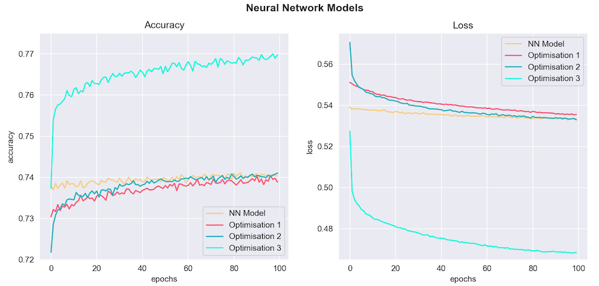

# TensorFlow Neural Network Model Report

A TensorFlow Neural Network Model that predicts grant applicants with the best chance of success for the nonprofit foundation, Alphabet Soup.

Created and submitted for an assignment for Monash University Data Analytics Boot Camp (October 2023).

## Table of Contents

- [Overview](#overview)
- [Results](#results)
- [Summary](#summary)

## Overview

### Purpose

- The purpose of this analysis is to predict applicants of Alphabet Soup that have the best chance of project success/completion based on various grant application features.
- This model was developed using a TensorFlow Neural Network and will serve to maximise the deliverables to investment ratio for the nonprofit organisation, Alphabet Soup.

## Results

### Data Preprocessing

- **Target variable (y):**

  - `IS_SUCCESSFUL`: Binary False or True (`0 or 1` ) indication of project success i.e the project failed to deliver or successfully delivered on the proposed aims. 

- **Feature variables (X):**

  - `EIN` and `NAME`: Indentification columns
  - `APPLICATION_TYPE`: Alphabet Soup application type
  - `AFFILIATION`: Affiliated sector of industry
  - `CLASSIFICATION`: Government organisation classification
  - `USE_CASE`: Use case for funding
  - `ORGANIZATION`: Organisation type
  - `STATUS`: Active status
  - `INCOME_AMT`: Income classification
  - `SPECIAL_CONSIDERATIONS`: Special considerations for application
  - `ASK_AMT`: Funding amount requested
- **Removed Feature variables:**

  - `EIN` and `NAME` columns were initially excluded from the deep learning neural network model because they were identification Features only.
  - However, upon careful inspection of the `NAME` column, it was clear that this Feature was associated with the success of the project. As such, `NAME` was included in the `Optimisation 3` analysis and markedly improved the accuracy of the model.
  - `STATUS` was excluded from Optimisation steps because it was inconsequential to project success.

### Compilation, Training and Evaluation of the Model

- **Model Parameters:**

  - Upon using the `train_test_split()` function to split the data into Training and Testing data, `X_train` contained **43 inputs**. 

  - For this reason, two **hidden layers** were included with **80** and **30 neurons**, respectively. Generally speaking, using **2-3 times** the number of **neurons to inputs** is an appropriate starting point for the first hidden layer.

  - The two **hidden layers** were assigned `relu` activation function, as this activation function is typically used to model data initially.

  - The **output layer** was assigned `sigmoid` activation function because the output in this model was binary, and `sigmoid` is appropriate for binary values.

  - Deep Neural Network Models require many features and records to make accurate predictions. However, too many unique categorical values will negatively affect the model's performance. For this reason, the `APPLICATION_TYPE` and `CLASSIFICATION` columns/features were **binned** with cutoffs of `<500` and `<1000`, respectively.

  - Fully Connected NN Diagram:

    

  - Model Structure & Summary:

    

- **Model Performance:**

  - The initial model achieved an **accuracy** of `72.9 %` with a **loss** of `55.9 %`.

    

  - This result was under the accepted **accuracy** threshold of `75 %`, therefore the model was optimised.

### Optimisation of the Model

- **Optimisation 1:**

  - The `Keras-Tuner` library was used to auto-optimise the Neural Network model:

  - Performance:

    

  - Optimisation 1 achieved an **accuracy** of `73 %` with a **loss** of `55.3 %`, which was below the accepted threshold.

- **Optimisation 2:**

  - The inconsequential `STATUS` column/feature was dropped in order to refine the Neural Network model.

  - An extra **hidden layer** containing **55 neurons** and `relu` activation function was added to better handle the complexity of the model features.

  - Performance:

    

  - Optimisation 2 achieved an **accuracy** of `72.9 %` with a **loss** of `56.7 %`, which was below the accepted threshold.

- **Optimisation 3**

  - The `NAME` column was retained because it appeared to be associated with project success. The column was binned with a cutoff of `<100`.

  - Including the `NAME` column increased the number of inputs to `71`.

  - The **hidden layers** contained the same number of **neurons** as above, but contained `relu`, `sigmoid`, `sigmoid`, `sigmoid` activation functions.

  - Fully Connected NN Diagram:

    

  - Model Structure & Summary:

    

  - Performance:

    

  - Optimisation 3 achieved an **accuracy** of `75.5 %` with a **loss** of `50.9 %`, which was above the accepted threshold.

## Summary

- The Neural Network Model was successfully optimised to reach the desired **accuracy** threshold of `75 %` and could be deployed.

- Accuracy & Loss Summary Charts:

  

- The first model and initial Optimisations were not sufficient to reach the **accuracy** threshold. 

- The only way that I found to attain sufficient **accuracy** and reduce **loss**, was to include the `NAME` column in the analysis. This increased the number of **inputs** in `X_train` to `71` from `43`, which dramatically changed the shape of the dataset.

- While the model could be further optimised by again employing `Keras-Tuner` with the updated model input parameters, the current model as it stands after `Optimisation 3` is sufficiently accurate for deployment.

- That aside, adding additional **hidden layers** rather than **neurons** would likely increase the **accuracy** of the model, as the features in this dataset are complex.